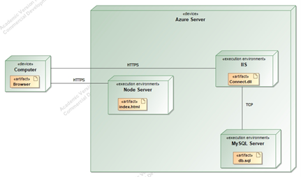

# Connect

Ši repozitorija sukurta Kauno technologijos universiteto Programų sistemos moduliui T120B165 Saityno taikomųjų programų projektavimas.

Visas darbas ir ši dokumentacija paruošta IFF-9/7 studentės Ugnės Glinskytės.

# Sprendžiamo uždavinio aprašymas
## Sistemos paskirtis

Projekto tikslas – palengvinti terapeuto ir kliento interakciją, sukuriant centralizuotą terapeutų paieškos sistemą.

Veikimo principas – pačią kuriamą platformą sudaro dvi dalys: internetinė aplikacija, kuria naudosis klientas ir terapeutas bei aplikacijų programavimo sąsaja (angl. trump. API).

Terapeutas, norėdamas naudotis šia platforma, užsiregistruoja sistemoje pasirinkdamas savo specializacijos kryptį ar kryptis. Terapuetas gali kurti seansus. Kai seansas baigiasi, terapuetas gali palikti užrašus apie įvykusį seansą bei priskirti namų darbus, užduotus po seanso. Terapeutas taip pat gali ištrinti neužrezervuotus seansus. Terapeutas turi galimybę peržiūrėti jau įvykusius ir įvyksiančius seansus. Klientas taip pat gali matyti savo seansų istoriją, namų darbus bei atšaukti dar neprasidėjusius seansus. Užsiregistruoti į seansą gali tik klientas.

Sistemos administratorius gali kurti terapuetų kvalifikacijas.

Neprisregistravęs vartotojas gali pasirinkęs jam norimą terapeutų specializacijos kategoriją, peržiūrėti pasirinkto terapeuto laisvus seansus. Taip pat peržiūrėti visas kvalifikacijas nesurišant jų su terapeutais.

## Funkciniai reikalavimai

Neregistruotas sistemos naudotojas gali:
1.	Peržiūrėti platformos reprezentacinį puslapį;
2.	Perskaityti klasifikacijų tipų aprašymus bei jas turinčius terapeutus;
3.	Matyti laisvus galimus laikus pasirinktam terapeutui.
4.	Prisijungti (užsiregistruoti) prie internetinės aplikacijos.

Visi registruoti sistemos naudotojai gali:
1.	Prisijungti prie internetinės aplikacijos;
2.	Atsijungti nuo internetinės aplikacijos.

Registruotas sistemos naudotojas (terapeutas) gali:
1.	Pridėti naujus laikus;
2.	Ištrinti neužrezervuotus laikus;
3.	Peržiūrėti rezervuotus laikus ir tuo laiku užsiregistravusius klientus;
4.	Peržiūrėti seanso namų darbų sąrašą;
5.	Pridėti įvykusiam seansui namų darbus;
6.  Redaguoti įvykusio seanso namų darbus;
7.  Ištrinti įvykusio seanso namų darbus;
8.	Redaguoti įvykusio seanso užrašus;


Registruotas sistemos naudotojas (klientas) gali:
1.	Užsiregistruoti į seansą pas pasirinktą terapeutą.
2.	Atšaukti seansą su terapeutu, jeigu iki seanso pradžios like nemažiau, kaip para.
3.	Peržiūrėti savo seansų istoriją;
4.	Peržiūrėti seanso namų darbų sąrašą;

Sistemos administratorius gali:
1.  Sukurti terapeutų kategoriją;
2.	Redaguoti terapeutų kategoriją;
3.	Šalinti terapeutų kategorija.

# Sistemos architektūra
Sistemos sudedamosios dalys: 
*	Kliento pusė (ang. Front-End) – naudojant React.js; 
*	Serverio pusė (angl. Back-End) – naudojant C# .NET. Duomenų bazė – MySQL. 

2.1 pav. pavaizduota kuriamos sistemos diegimo diagrama. Sistemos talpinimui yra naudojamas Azure serveris. Kiekviena sistemos dalis yra diegiama tame pačiame serveryje. Internetinė aplikacija yra pasiekiama per HTTPS protokolą. Šios sistemos veikimui (pvz., duomenų manipuliavimui su duomenų baze) yra reikalingas IIS, kuris pasiekiamas per aplikacijų programavimo sąsają. Pats IIS vykdo duomenų mainus su duomenų baze - tam naudojamas TCP komunikacijos protokolas.



_2.1 pav. Sistemos Connect diegimo diagrama_

# API specifikacija
Tam, kad būtų išlaikomas nuoseklumas, sistemos API metodai bus aprašomi remiantis Twitter API užklausų aprašymais. Aprašymuose pateikiama svarbiausia bei būtina informacija sėkmingam užklausos vykdymui. Taip pat pateikiama informacija apie galimas klaidas, kurios gali iškilti apdorojant tam tikrą API užklausą. Verta paminėti, kad kelias iki metodo yra nurodomas tik parašant URL galutinę dalį, nes domenas gali skirtis.

# Therepuets
## GET _/qualifications/:qualification_id/therepuets_

Grąžina terapuetų sąrašą pagal nurodytą kvalifikaciją.


**Nuorodos URL**

`https://localhost:7037/api/qualifications/:qualification_id/therepuets`

**Nuorodos parametrai**
|Vardas| Tipas| Aprašymas|
|:--:|:--:|:--:|
|`qualification_id` | int| Kvalifikacijos, kuriai ieškomi terapeutai, numeris|

**Reikalinga autorizacija**

Šiai užklausai autorizacija nereikalinga.


**Rezultatų pavyzdžiai**

Sėkmingo rezultato kodas: 200.

Sėkmingo rezultato struktūra:
```
[
	{
		"user": {
			"id": 1,
			"name": "Johnathan",
			"surname": "Smithson"
		}
	},
	{
		"user": {
			"id": 2,
			"name": "Bellatrix",
			"surname": "Lestrange"
		}
	}
]
```

|Galimi klaidų kodai|Sąlyga|
|:--:|:--:|
|404| Jei pagal pateiktu paieškos kriterijus, terapeutas nebuvo rastas|


## GET _/qualifications/:qualification_id/therepuets/:therepuet_id_

Grąžina pasirinktą terapuetą pagal nurodytą kvalifikaciją.


**Nuorodos URL**

`https://localhost:7037/api/qualifications/:qualification_id/therepuets/:therepuet_id`

**Nuorodos parametrai**
|Vardas| Tipas| Aprašymas|
|:--:|:--:|:--:|
|`qualification_id` | int| Kvalifikacijos, kuriai ieškomi terapeutai, numeris|
|`therepuet_id` | int| Ieškomo terapueto numeris|

**Reikalinga autorizacija**

Šiai užklausai autorizacija nereikalinga.


**Rezultatų pavyzdžiai**

Sėkmingo rezultato kodas: 200.

Sėkmingo rezultato struktūra:
```
{
	"user": {
		"id": 1,
		"name": "John",
		"surname": "Smith"
	}
}
```
|Galimi klaidų kodai|Sąlyga|
|:--:|:--:|
|404| Jei pagal pateiktu paieškos kriterijus, terapeutas nebuvo rastas|

# Homeworks
## GET _/sessions/:session_id/homeworks_

Grąžina namų darbų sąrašą pasirinktai sesijai.


**Nuorodos URL**

`https://localhost:7037/api/sessions/:session_id/homeworks`

**Nuorodos parametrai**

|Vardas| Tipas| Aprašymas|
|:--:|:--:|:--:|
|`session_id` | int| Sesijos, kuriai ieškomi namų darbai, numeris|

**Reikalinga autorizacija**

Sistemos vartotojas turi būti autorizuotas, kaip vienas iš žemiau nurodytų vartotojų:
||
|:--:|
|Terapeutas |
|Klientas |


**Rezultatų pavyzdžiai**

Sėkmingo rezultato kodas: 200.

Sėkmingo rezultato struktūra:
```
[
	{
		"id": 1,
		"task": "This is homework for client.",
		"time": "2022-09-29T17:32:51.867",
		"sessionId": 1
	}
]
```
|Galimi klaidų kodai|Sąlyga|
|:--:|:--:|
|404| Jei pagal pateiktu paieškos kriterijus, namų darbai nebuvo rasti|
|401| Jei vartotojas nėra autorizuotas|
|403| Jei vartotojo rolė netenkina reikalaujamų rolių|

## GET _/sessions/:session_id/homeworks/:homework_id_

Grąžina pasirinktą namų darbą pasirinktai sesijai.


**Nuorodos URL**

`https://localhost:7037/api/sessions/:session_id/homeworks/:homework_id`


**Nuorodos parametrai**
|Vardas| Tipas| Aprašymas|
|:--:|:--:|:--:|
|`session_id` | int| Sesijos, kuriai ieškomi namų darbai, numeris|
|`homework_id` | int| Namų darbo numeris|

**Reikalinga autorizacija**

Sistemos vartotojas turi būti autorizuotas, kaip vienas iš žemiau nurodytų vartotojų:
||
|:--:|
|Terapeutas |
|Klientas |


**Rezultatų pavyzdžiai**

Sėkmingo rezultato kodas: 200.

Sėkmingo rezultato struktūra:
```
{
	"id": 1,
	"task": "This is homework for client.",
	"time": "2022-09-29T17:32:51.867",
	"sessionId": 1
}
```
|Galimi klaidų kodai|Sąlyga|
|:--:|:--:|
|404| Jei pagal pateiktu paieškos kriterijus, namų darbai nebuvo rasti|
|401| Jei vartotojas nėra autorizuotas|
|403| Jei vartotojo rolė netenkina reikalaujamų rolių|

## POST _/sessions/:session_id/homeworks_

Sukuria namų darbą pasirinktai sesijai.


**Nuorodos URL**

`https://localhost:7037/api/sessions/:session_id/homeworks`

**Nuorodos parametrai**
|Vardas| Tipas| Aprašymas|
|:--:|:--:|:--:|
|`session_id` | int| Sesijos, kuriai kuriamas namų darbas, numeris|

**Reikalinga autorizacija**

Sistemos vartotojas turi būti autorizuotas, kaip vienas iš žemiau nurodytų vartotojų:
||
|:--:|
|Terapeutas |


**Rezultatų pavyzdžiai**

Sėkmingo rezultato kodas: 201.

|Galimi klaidų kodai|Sąlyga|
|:--:|:--:|
|400| Jei pagal pateiktu paieškos kriterijus, jokia sesija nebuvo rasta|
|401| Jei vartotojas nėra autorizuotas|
|403| Jei vartotojo rolė netenkina reikalaujamų rolių|

## PUT _/sessions/:session_id/homeworks/:homework_id_

Redaguoja pasirinktą namų darbą pasirinktai sesijai.


**Nuorodos URL**

`https://localhost:7037/api/sessions/:session_id/homeworks/:homework_id`

**Nuorodos parametrai**
|Vardas| Tipas| Aprašymas|
|:--:|:--:|:--:|
|`session_id` | int| Sesijos, kuriai kuriami namų darbai, numeris|
|`homework_id` | int| Namų darbų numeris|

**Reikalinga autorizacija**

Sistemos vartotojas turi būti autorizuotas, kaip vienas iš žemiau nurodytų vartotojų:
||
|:--:|
|Terapeutas |


**Rezultatų pavyzdžiai**

Sėkmingo rezultato kodas: 200.

Sėkmingo rezultato struktūra:
```
{
	"id": 1,
	"task": "This is homework for client.",
	"time": "2022-09-29T17:32:51.867Z",
	"sessionId": 1
}
```
|Galimi klaidų kodai|Sąlyga|
|:--:|:--:|
|404| Jei pagal pateiktu paieškos kriterijus, norimi redaguoti namų darbai nebuvo rasti|
|401| Jei vartotojas nėra autorizuotas|
|403| Jei vartotojo rolė netenkina reikalaujamų rolių|

## DELETE _/sessions/:session_id/homeworks/:homework_id_

Ištrina pasirinktą namų darbą pasirinktai sesijai.


**Nuorodos URL**

`https://localhost:7037/api/sessions/:session_id/homeworks/:homework_id`

**Nuorodos parametrai**
|Vardas| Tipas| Aprašymas|
|:--:|:--:|:--:|
|`session_id` | int| Sesijos, kuriai kuriami namų darbai, numeris|
|`homework_id` | int| Namų darbų numeris|

**Reikalinga autorizacija**

Sistemos vartotojas turi būti autorizuotas, kaip vienas iš žemiau nurodytų vartotojų:
||
|:--:|
|Terapeutas |


**Rezultatų pavyzdžiai**

Sėkmingo rezultato kodas: 204.

|Galimi klaidų kodai|Sąlyga|
|:--:|:--:|
|404| Jei pagal pateiktu paieškos kriterijus, norimi ištrinti namų darbai nebuvo rasti|
|401| Jei vartotojas nėra autorizuotas|
|403| Jei vartotojo rolė netenkina reikalaujamų rolių|


# Sessions
## GET _qualifications/:qualification_id/therepuets/:therepuet_id/sessions_

Grąžina pasirinktos kvalifikacijos pasirinkto terapeuto sesijų sąrašą.


**Nuorodos URL**

`https://localhost:7037/api/qualifications/:qualification_id/therepuets/:therepuet_id/sessions`

**Nuorodos parametrai**

|Vardas| Tipas| Aprašymas|
|:--:|:--:|:--:|
|`qualification_id` | int| Kvalifikacijos, kurios terapeuto sesijos ieškomos, numeris|
|`therepuet_id` | int| Terapeuto, kurio sesijos ieškomos, numeris|

**Reikalinga autorizacija**

Šiai užklausai autorizacija nereikalinga.


**Rezultatų pavyzdžiai**

Sėkmingo rezultato kodas: 200.

Sėkmingo rezultato struktūra:
```
[
	{
		"id": 2,
		"startTime": "2022-11-01T10:50:46.493",
		"durationInMinutes": 45,
		"therepuetId": 3
	}
]
```
|Galimi klaidų kodai|Sąlyga|
|:--:|:--:|
|404| Jei pagal pateiktu paieškos kriterijus, namų darbai nebuvo rasti|

## GET _qualifications/:qualification_id/therepuets/:therepuet_id/sessions/:session_id_

Grąžina pasirinktos kvalifikacijos pasirinkto terapeuto sesiją.


**Nuorodos URL**

`https://localhost:7037/api/qualifications/:qualification_id/therepuets/:therepuet_id/sessions/:session_id`


**Nuorodos parametrai**

|Vardas| Tipas| Aprašymas|
|:--:|:--:|:--:|
|`qualification_id` | int| Kvalifikacijos, kurios terapeuto sesijos ieškomos, numeris|
|`therepuet_id` | int| Terapeuto, kurio sesijos ieškomos, numeris|
|`session_id` | int| Ieškomos sesijos numeris|

**Reikalinga autorizacija**

Šiai užklausai autorizacija nereikalinga.


**Rezultatų pavyzdžiai**

Sėkmingo rezultato kodas: 200.

Sėkmingo rezultato struktūra:
```
{
	"id": 2,
	"startTime": "2022-11-01T10:50:46.493",
	"durationInMinutes": 45,
	"therepuetId": 3
}
```
|Galimi klaidų kodai|Sąlyga|
|:--:|:--:|
|404| Jei pagal pateiktu paieškos kriterijus, sesijos nebuvo rastos|


## GET _/sessions_

Grąžina sesijų sąrašą, priklausantį registruotam sistemos vartotojui.


**Nuorodos URL**

`https://localhost:7037/api/sessions`

**Reikalinga autorizacija**

Sistemos vartotojas turi būti autorizuotas, kaip vienas iš žemiau nurodytų vartotojų:
||
|:--:|
|Terapeutas |
|Klientas |


**Rezultatų pavyzdžiai**

Sėkmingo rezultato kodas: 200.

Sėkmingo rezultato struktūra, jei vartotojas yra klientas:
```
[
	{
		"id": 1,
		"startTime": "2022-10-01T10:50:46.493",
		"durationInMinutes": 45,
		"therepuet": {
			"user": {
				"id": 3,
				"name": "John",
				"surname": "Smith"
			}
		}
	}
]
```
Sėkmingo rezultato struktūra, jei vartotojas yra terapeutas:
```
[
	{
		"id": 1,
		"startTime": "2022-10-01T10:50:46.493",
		"durationInMinutes": 45,
		"client": {
			"id": 2,
			"name": "Jane",
			"surname": "Doe"
		}
	},
	{
		"id": 2,
		"startTime": "2022-11-01T10:50:46.493",
		"durationInMinutes": 45,
		"client": null
	}
]
```
|Galimi klaidų kodai|Sąlyga|
|:--:|:--:|
|404| Jei pagal pateiktu paieškos kriterijus, sesijos nebuvo rastos|
|401| Jei vartotojas nėra autorizuotas|
|403| Jei vartotojas neturi tinkamos rolės|

## GET _/sessions/:session_id_

Grąžina sesiją, priklausančią registruotam sistemos vartotojui.


**Nuorodos URL**

`https://localhost:7037/api/sessions/:session_id`

**Nuorodos parametrai**

|Vardas| Tipas| Aprašymas|
|:--:|:--:|:--:|
|`session_id` | int| Ieškomos sesijos numeris|

**Reikalinga autorizacija**

Sistemos vartotojas turi būti autorizuotas, kaip vienas iš žemiau nurodytų vartotojų:
||
|:--:|
|Terapeutas |
|Klientas |


**Rezultatų pavyzdžiai**

Sėkmingo rezultato kodas: 200.

Sėkmingo rezultato struktūra, jei vartotojas yra klientas:
```
{
	"id": 1,
	"startTime": "2022-10-01T10:50:46.493",
	"durationInMinutes": 45,
	"therepuet": {
		"user": {
			"id": 3,
			"name": "John",
			"surname": "Smith"
		}
	}
}
```
Sėkmingo rezultato struktūra, jei vartotojas yra terapeutas:
```
{
	"id": 1,
	"startTime": "2022-10-01T10:50:46.493",
	"durationInMinutes": 45,
	"client": {
		"id": 2,
		"name": "Jane",
		"surname": "Doe"
	}
}
```
|Galimi klaidų kodai|Sąlyga|
|:--:|:--:|
|404| Jei pagal pateiktu paieškos kriterijus, sesijos nebuvo rastos|
|401| Jei vartotojas nėra autorizuotas|
|403| Jei vartotojas neturi tinkamos rolės|

## POST _/sessions_

Sukuria naują sesiją.


**Nuorodos URL**

`https://localhost:7037/api/sessions`

**Reikalinga autorizacija**

Sistemos vartotojas turi būti autorizuotas, kaip vienas iš žemiau nurodytų vartotojų:
||
|:--:|
|Terapeutas |


**Rezultatų pavyzdžiai**

Sėkmingo rezultato kodas: 201.

Sėkmingo rezultato struktūra:
```
{
	"id": 1,
	"startTime": "2022-11-02T10:50:46.494Z",
	"durationInMinutes": 45,
	"therepuetId": 3
}
```

|Galimi klaidų kodai|Sąlyga|
|:--:|:--:|
|400| Jei nurodyti neteisingi parametrai sesijai sukurti|
|401| Jei vartotojas nėra autorizuotas|
|403| Jei vartotojas neturi tinkamos rolės|

## PATCH _/sessions/:session_id/note_

Redaguoja pasirinktos sesijos užrašus.


**Nuorodos URL**

`https://localhost:7037/api/sessions/:session_id/note`

**Nuorodos parametrai**

|Vardas| Tipas| Aprašymas|
|:--:|:--:|:--:|
|`session_id` | int| Sesijos, kuriai norima redaguoti užrašus, numeris|

**Reikalinga autorizacija**

Sistemos vartotojas turi būti autorizuotas, kaip vienas iš žemiau nurodytų vartotojų:
||
|:--:|
|Terapeutas |


**Rezultatų pavyzdžiai**

Sėkmingo rezultato kodas: 200.
Sėkmingo rezultato struktūra:
```
{
	"id": 1,
	"startTime": "2022-11-02T10:50:46.494Z",
	"durationInMinutes": 45,
	"therepuetId": 3
}
```

|Galimi klaidų kodai|Sąlyga|
|:--:|:--:|
|400| Jei nurodytos sesijos užrašai, dar negalimi redaguoti|
|404| Jei nurodyta sesija nebuvo rasta|
|401| Jei vartotojas nėra autorizuotas|
|403| Jei vartotojas neturi tinkamos rolės|

## PATCH _/sessions/:session_id/reservation_

Rezervuoja arba atšaukia pasirinktą sesiją.


**Nuorodos URL**

`https://localhost:7037/api/sessions/:session_id/reservation`

**Nuorodos parametrai**

|Vardas| Tipas| Aprašymas|
|:--:|:--:|:--:|
|`session_id` | int| Sesijos, kurios užimtumą norima keisti, numeris|

**Reikalinga autorizacija**

Sistemos vartotojas turi būti autorizuotas, kaip vienas iš žemiau nurodytų vartotojų:
||
|:--:|
|Klientas |


**Rezultatų pavyzdžiai**

Sėkmingo rezultato kodas: 200.


|Galimi klaidų kodai|Sąlyga|
|:--:|:--:|
|400| Jei sesijos užrezervuoti nėra galima |
|404| Jei nurodyta sesija nebuvo rasta|
|401| Jei vartotojas nėra autorizuotas|
|403| Jei vartotojas neturi tinkamos rolės|

## GET _/qualifications_

Grąžina visų kvalifikacijų sąrašą.


**Nuorodos URL**

`https://localhost:7037/api/qualifications`

**Reikalinga autorizacija**

Šiai užklausai autorizacija nereikalinga.


**Rezultatų pavyzdžiai**

Sėkmingo rezultato kodas: 200.
Sėkmingo rezultato struktūra:
```
[
	{
		"id": 1,
		"name": "Simple qualification",
		"description": "Description for simple qualification."
	},
	{
		"id": 2,
		"name": "Advanced qualification",
		"description": "Description for advanced qualification."
	},
	{
		"id": 3,
		"name": "Supreme type qualification",
		"description": "Description for supreme type qualification."
	}
]
```

|Galimi klaidų kodai|Sąlyga|
|:--:|:--:|
|404| Kvalifikacijos nebuvo rastos|

## GET _/qualifications/:qualification_id_

Grąžina pasirinktą kvalifikaciją.


**Nuorodos URL**

`https://localhost:7037/api/qualifications/:qualification_id`

**Nuorodos parametrai**

|Vardas| Tipas| Aprašymas|
|:--:|:--:|:--:|
|`qualification_id` | int| Kvalifikacijos, kurią norima gauti, numeris|

**Reikalinga autorizacija**

Šiai užklausai autorizacija nereikalinga.


**Rezultatų pavyzdžiai**

Sėkmingo rezultato kodas: 200.
Sėkmingo rezultato struktūra:
```
{
	"id": 1,
	"name": "Simple qualification",
	"description": "Description for simple qualification."
}
```

|Galimi klaidų kodai|Sąlyga|
|:--:|:--:|
|404| Kvalifikacija nebuvo rasta|

## POST _/qualifications_

Sukuria naują kvalifikaciją.


**Nuorodos URL**

`https://localhost:7037/api/qualifications`

**Reikalinga autorizacija**

Sistemos vartotojas turi būti autorizuotas, kaip vienas iš žemiau nurodytų vartotojų:
||
|:--:|
|Administratorius |


**Rezultatų pavyzdžiai**

Sėkmingo rezultato kodas: 201.
Sėkmingo rezultato struktūra:
```
{
	"name": "Supreme type qualification",
	"description": "Description for supreme type qualification."
}
```

|Galimi klaidų kodai|Sąlyga|
|:--:|:--:|
|401| Vartotojas nėra autorizuotas|
|403| Jei vartotojas neturi tinkamos rolės|

## PUT _/qualifications/:qualification_id_

Redaguoja pasirinktą kvalifikaciją.


**Nuorodos URL**

`https://localhost:7037/api/qualifications/:qualification_id`

**Nuorodos parametrai**

|Vardas| Tipas| Aprašymas|
|:--:|:--:|:--:|
|`qualification_id` | int| Kvalifikacijos, kurią norima redaguoti, numeris|

**Reikalinga autorizacija**

Sistemos vartotojas turi būti autorizuotas, kaip vienas iš žemiau nurodytų vartotojų:
||
|:--:|
|Administratorius |


**Rezultatų pavyzdžiai**

Sėkmingo rezultato kodas: 200.


|Galimi klaidų kodai|Sąlyga|
|:--:|:--:|
|404| Kvalifikacija nebuvo rasta|
|401| Vartotojas nėra autorizuotas|
|403| Jei vartotojas neturi tinkamos rolės|

## DELETE _/qualifications/:qualification_id_

Ištrina pasirinktą kvalifikaciją.


**Nuorodos URL**

`https://localhost:7037/api/qualifications/:qualification_id`

**Nuorodos parametrai**

|Vardas| Tipas| Aprašymas|
|:--:|:--:|:--:|
|`qualification_id` | int| Kvalifikacijos, kurią norima ištrinti, numeris|

**Reikalinga autorizacija**

Sistemos vartotojas turi būti autorizuotas, kaip vienas iš žemiau nurodytų vartotojų:
||
|:--:|
|Administratorius |


**Rezultatų pavyzdžiai**

Sėkmingo rezultato kodas: 204.


|Galimi klaidų kodai|Sąlyga|
|:--:|:--:|
|404| Kvalifikacija nebuvo rasta|
|403| Jei vartotojas neturi tinkamos rolės|
|401| Vartotojas nėra autorizuotas|